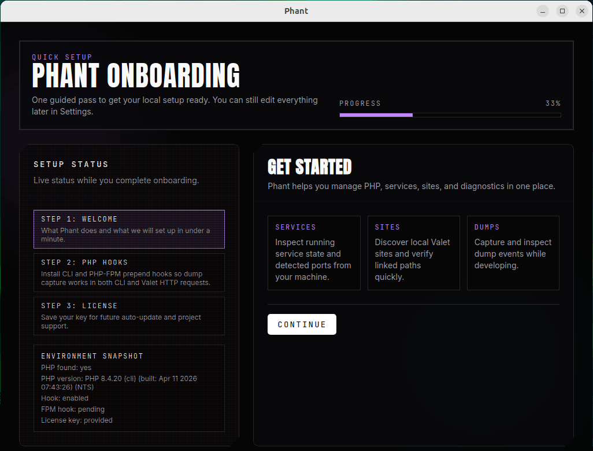

The first time you open Phant, you are guided through a short onboarding flow.

The goal of onboarding is to make Phant useful immediately, especially for dump capture in both CLI commands and Valet Linux HTTP requests.

## What you will see

The onboarding flow is split into three steps:

1. Welcome
2. PHP Hooks
3. License

Phant also shows a live environment snapshot while you move through setup.

## What Phant checks

During onboarding, Phant checks the current local environment and displays information such as:

- whether PHP is available
- the detected PHP version
- whether the CLI hook is already enabled
- whether the PHP-FPM hook is already enabled
- whether a license key has been provided

## Recommended first steps

Complete onboarding in this order.

1. Open Phant.
2. Review the environment snapshot on the Welcome step.
3. Continue to the PHP Hooks step.
4. Install the PHP CLI hook.
5. Install the PHP-FPM hook if you use Valet Linux.
6. Continue to the License step.
7. Enter your license key and save it.
8. Finish setup.

After onboarding, Phant opens the main app and takes you to the dumps view.

## Why the hooks matter

The hooks are what allow Phant to capture dump output from your PHP environment.

### PHP CLI hook

This hook enables dump capture for CLI commands such as artisan commands, scripts, and other command-line PHP execution.

### PHP-FPM hook

This hook is important if you use Valet Linux and want dump capture from HTTP requests served through PHP-FPM.

If you do not use Valet Linux yet, or if your environment is not ready, you can still continue and come back to this later from the app.

## Saving your license key

Phant lets you save your license key during onboarding.

In the current app experience, the license key is used for:

- auto-update eligibility
- supporting ongoing Phant development

You can edit the license key later from `Settings`.

## Common questions

### Do I need to finish every step before using Phant?

No, but Phant is much more useful after the hooks are installed.

### What if a hook is already enabled?

Phant shows that status during onboarding and avoids asking you to repeat unnecessary work.

### Can I change this later?

Yes. After onboarding, you can revisit the relevant areas from the app:

- `Settings` for license, updates, diagnostics, and Valet remediation
- `PHP` for PHP versions, settings, and extensions
- `Sites` for Valet site discovery
- `Services` for service status
- `Dumps` for live dump events

## Next steps

- Continue with [PHP Management](../guides/php-management/)
- Continue with [Sites and Valet](../guides/sites-and-valet/)
- Continue with [Dumps](../guides/dumps/)
