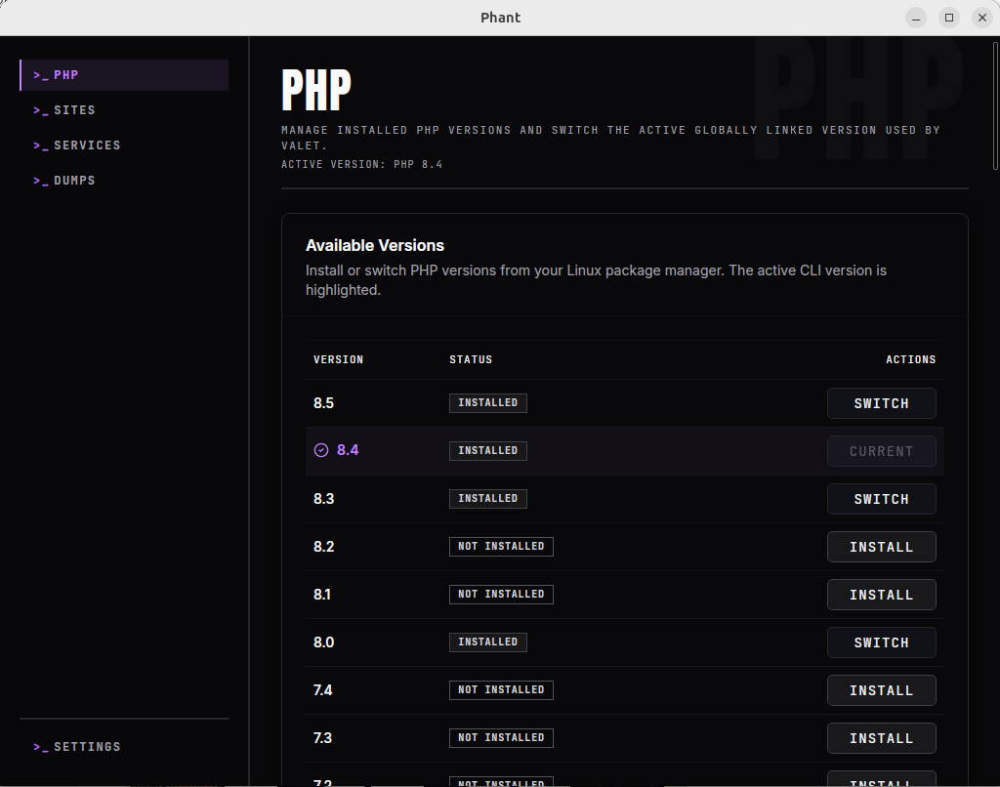

Use the `PHP` page to manage the PHP version Phant detects on your machine and to adjust the most common PHP runtime settings in one place.

Phant keeps the workflow app-focused, but some actions still rely on the tools and packages already present on your Linux system.

## What you can do

- View installed and available PHP versions.
- Install a PHP version.
- Switch the active PHP version.
- Update selected `php.ini` settings.
- Enable or disable PHP extensions.

## Open the PHP page

In Phant, open `PHP` from the main navigation.

The page is divided into three main areas:

- available versions
- PHP settings
- extensions

## Install a PHP version

Use this when the version you need appears in the list but is not installed yet.

1. Open `PHP`.
2. Find the version you want in `Available Versions`.
3. Click `Install`.

What to expect:

- Phant checks the version format and system availability.
- On supported Linux setups, Phant can use your system package manager underneath.
- If elevated privileges are required, Phant may ask for them or provide suggested commands.

Expected result:

- the version becomes installed
- it remains available in the list for future switching

## Switch the active PHP version

Use this when you already have multiple PHP versions installed and want to change the active CLI version.

1. Open `PHP`.
2. In `Available Versions`, locate an installed version that is not current.
3. Click `Switch`.

Expected result:

- the selected version becomes the active version in Phant
- the current version row updates visually

If you also use Valet Linux, remember that switching the global CLI version does not replace all Valet-specific PHP behavior automatically. If needed, verify your Valet runtime after switching.

## Update PHP settings

Use the `PHP Settings` section to change the most common runtime values Phant manages.

The current UI exposes:

- `upload_max_filesize`
- `post_max_size`
- `memory_limit`
- `max_execution_time`

To update them:

1. Open `PHP`.
2. Edit one or more values in `PHP Settings`.
3. Click `Save Settings`.

Expected result:

- Phant writes a managed INI file for CLI
- Phant also targets detected PHP-FPM services when possible
- related PHP-FPM services may be restarted as part of the change

## Enable or disable PHP extensions

Use the `Extensions` table when you need to change common extension state across installed PHP versions.

1. Open `PHP`.
2. Scroll to `Extensions`.
3. Find the extension you want to change.
4. Click `Enable` or `Disable`.

Expected result:

- the extension state updates in the list
- Phant restarts detected PHP-FPM services when needed

## Daily workflow

This is a practical routine for everyday work:

1. Open `PHP` and confirm the active version.
2. Switch versions if the current project needs another runtime.
3. Adjust runtime limits only when the project actually requires them.
4. Enable or disable extensions only when a dependency or framework requires a change.
5. Re-check related project behavior after major PHP changes.

## Important behavior

- Some actions may require elevated privileges.
- PHP settings changes can affect both CLI and detected PHP-FPM targets.
- Extension changes can trigger PHP-FPM restarts.
- Install actions depend on what your Linux environment exposes to Phant.

## Troubleshooting

### A PHP install action does not complete

Check whether:

- the version exists in the list as expected
- your system supports the required package-manager commands
- Phant returned a suggested command that needs to be run manually

### A switched PHP version does not match your project behavior

Check whether:

- the CLI version changed but your site still uses another PHP-FPM runtime
- Valet Linux needs separate verification after the switch

### Settings saved but the app still behaves the same

Check whether:

- the project is actually using the PHP runtime you edited
- a related PHP-FPM service needs to be restarted or re-verified
