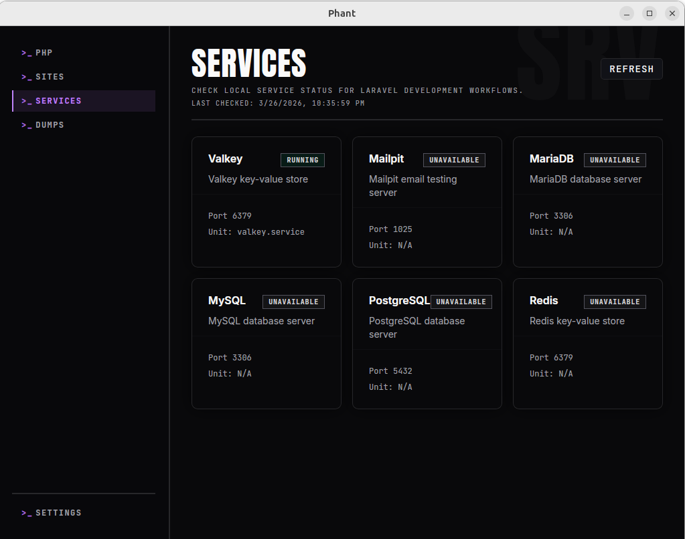

Use the `Services` page to inspect the current status of common local development services from one place.

Phant presents this as a status and inspection view. It helps you understand what is running, stopped, or unavailable on your machine, but it is not intended to replace your system service tools.

## What Phant shows

The current service set includes:

- PostgreSQL
- MySQL
- MariaDB
- Redis
- Valkey
- Mailpit

For each detected service, Phant can show:

- service name
- short description
- current state
- detected port
- related system unit when available

States are shown as:

- `Running`
- `Stopped`
- `Unavailable`

## Open the Services page

Open `Services` from the main navigation.

Use `Refresh` whenever you want a fresh machine status snapshot.

## How to use it

The `Services` page is most useful as a quick operational check.

Use it when you want to answer questions like:

- Is my database server running?
- Is Redis or Valkey available right now?
- Is Mailpit up on this machine?
- Did a service stop after I changed something in my environment?

## Recommended workflow

1. Open `Services`.
2. Review the services marked as `Running` first.
3. Check any service marked as `Stopped` if your project depends on it.
4. Treat `Unavailable` as not installed, not detected, or not discoverable through the current system view.
5. Refresh after making changes outside Phant.

## What the states mean

### Running

The service was detected and is active.

### Stopped

The service unit exists, but it is not currently active.

### Unavailable

Phant could not confirm the service as installed or discoverable in the current environment.

This does not always mean something is broken. It can also mean the service is not installed, not managed in the expected way, or not available through the current discovery path.

## Troubleshooting

### A service I expect is shown as stopped

Check whether:

- the service is actually running outside Phant
- your system service manager reports it as active
- the project is using that exact service and not an alternative

### A service is shown as unavailable

Check whether:

- the service is installed on the machine
- the service is managed through the expected system service tooling
- the machine exposes the service in a way Phant can discover

### The status looks outdated

Use `Refresh` after you change anything outside the app.
