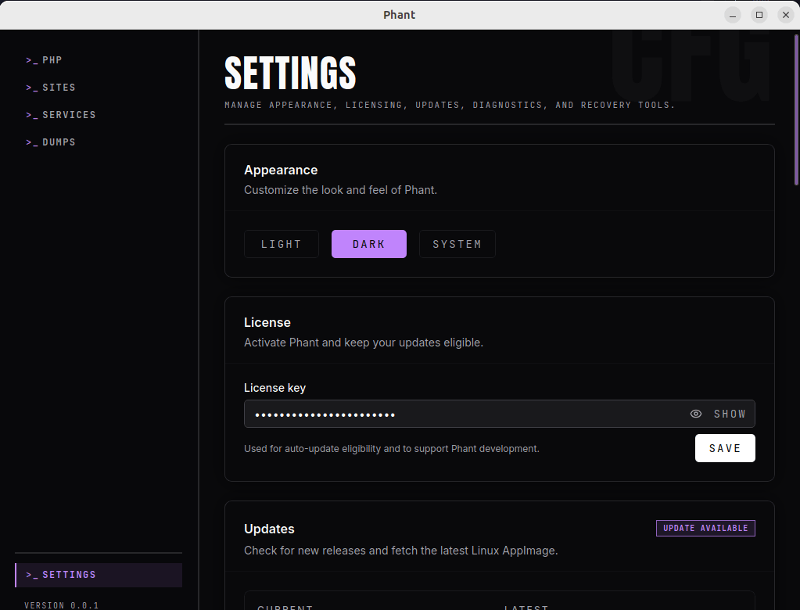

Use the `Settings` page to manage app behavior, license information, updates, diagnostics, and Valet-related recovery tools.

This page combines several operational areas that help you maintain Phant after initial setup.

## What users can configure

The current `Settings` page includes:

- appearance
- license key
- updates
- diagnostics
- Valet verification and remediation

## Appearance

Use `Appearance` to switch between:

- Light
- Dark
- System

This changes how Phant looks, but it does not affect your PHP or environment setup.

## License

Use `License` to save or update your Phant license key.

The current documented purpose of the license key is:

- auto-update eligibility
- support for ongoing Phant development

To update it:

1. open `Settings`
2. go to `License`
3. enter or edit the key
4. click `Save`

## Updates

Use `Updates` to manage Linux AppImage updates from inside Phant.

The page can show:

- current version
- latest version
- update status
- release notes when available

With a valid license, Phant can check for updates, download the latest Linux AppImage update, and install it from the app flow.

Typical update workflow:

1. open `Settings`
2. go to `Updates`
3. click `Check for updates`
4. if an update is available, click `Download`
5. when ready, click `Install & restart`

## Diagnostics

Use `Diagnostics` when you want to inspect the local PHP CLI setup and manage hook installation.

This area is useful for:

- checking whether PHP was found
- reviewing the detected PHP version
- managing CLI hook setup

If dump capture is not working from CLI commands, this is one of the first places to check.

## Valet

The `Valet` section inside `Settings` gives you embedded access to verification and remediation tools.

Use this when:

- you want to review Valet status without leaving `Settings`
- you need to refresh the current verification state
- you need to apply remediation for PHP-FPM hook wiring

This overlaps with the dedicated Valet workflow covered in [Sites and Valet](./sites-and-valet/).

## Stored data

Phant stores some app data locally.

One important documented example is the app settings file used for persisted settings such as the license key:

- `~/.config/phant/settings.json`

## Recommended workflow

Use `Settings` for maintenance tasks rather than constant day-to-day navigation.

Typical workflow:

1. update your license key if needed
2. check for updates occasionally
3. review diagnostics when CLI behavior changes
4. review Valet verification when HTTP dump capture stops working
5. adjust appearance whenever you prefer

## Troubleshooting

### My license key was entered but updates still do not work

Check whether:

- the key was saved successfully
- the app is showing the expected current version
- the update section reports an eligibility or download error

### The update was downloaded but not installed

Check whether:

- the update file path is shown correctly
- the install action returned an error
- a restart was blocked by the environment

### CLI dump capture is failing

Check whether:

- diagnostics still detect PHP correctly
- the CLI hook is enabled
- the dumps Runtime panel shows the collector as healthy

### HTTP dump capture is failing

Check whether:

- the embedded Valet section shows recommendations
- PHP-FPM remediation is still needed
- the related PHP-FPM service is active
