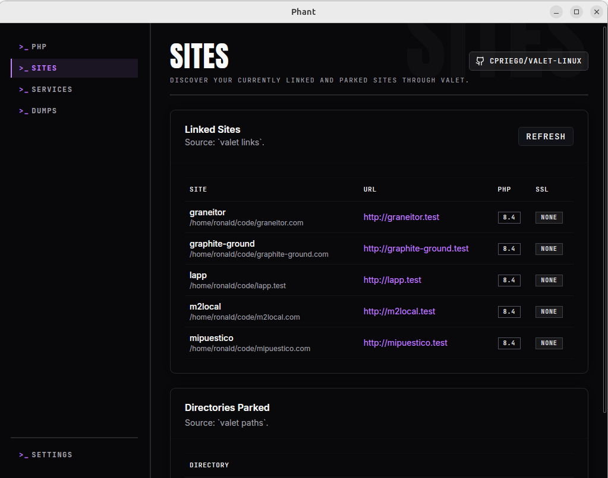

Use this guide to understand how Phant works with Valet Linux for local sites, linked domains, parked directories, and PHP-FPM verification.

Phant does not install Valet Linux for you. If you want to use the `Sites` and `Valet` workflows fully, make sure Valet Linux is already installed and working on your machine.

Valet Linux project:

- https://github.com/cpriego/valet-linux

## What this guide covers

- site discovery
- local domains
- Valet verification
- remediation flow when configuration is incomplete

## Open the relevant pages

Phant uses two related areas for this workflow:

- `Sites`
- `Valet`

Use `Sites` for discovery and inspection.

Use `Valet` for verification and remediation.

## Use the Sites page

The `Sites` page helps you inspect what Valet Linux already knows about your machine.

### What you can see

In `Sites`, Phant can show:

- linked sites
- local URLs
- detected PHP version per site when available
- SSL status
- parked directories

### Inspect linked sites

Use `Linked Sites` to review the site definitions Phant reads from Valet.

Each row can include:

- site name
- project path
- local URL
- PHP version
- SSL status

This is useful when you want to confirm that a project is already linked correctly and that its local domain matches your expectation.

### Inspect parked directories

Use `Directories Parked` to review the folders Valet watches for parked projects.

This is useful when:

- you expect a project directory to resolve automatically
- you want to confirm that a development folder is being watched by Valet

## Use the Valet page

The `Valet` page helps you verify whether Valet Linux and PHP-FPM are wired correctly for Phant features such as HTTP dump capture.

### What Phant verifies

Phant checks details such as:

- whether Valet is detected in your `PATH`
- the service manager in use
- CLI `conf.d` path
- current CLI `auto_prepend_file`
- expected prepend path used by Phant
- discovered PHP-FPM services
- recommendations based on the current state

### Refresh verification

Use `Refresh` when:

- you changed your Valet setup outside Phant
- you installed or switched PHP-FPM versions
- you want a fresh verification snapshot

### Apply remediation

Use `Apply Remediation` when Phant reports that a detected PHP-FPM service is not wired to the expected prepend script.

Before applying remediation:

1. review the verification details
2. enable the confirmation checkbox
3. click `Apply Remediation`

What this is intended to do:

- write or update the required `99-phant.ini` file for detected PHP-FPM services
- attempt related service restarts when needed

### Read recommendations

Always review the recommendations list before making changes.

This helps you understand whether the problem is:

- missing Valet installation
- missing or mismatched prepend configuration
- inactive PHP-FPM services
- a custom environment that needs manual verification

## Typical workflow

1. Open `Sites` and confirm the project appears as expected.
2. Check the local URL, PHP version, and SSL state.
3. Review parked directories if the project should resolve automatically.
4. Open `Valet` and run `Refresh`.
5. Review recommendations.
6. Apply remediation only if Phant shows that PHP-FPM hook configuration is incomplete.
7. Re-test the local site in the browser.

## Important notes

- Phant works with your existing Valet Linux setup.
- The `Sites` view is for discovery and inspection, not for creating or linking sites directly inside Phant.
- The `Valet` view is where verification and remediation happen.
- HTTP dump capture depends on correct PHP-FPM wiring, not only on CLI setup.

## Troubleshooting

### My site does not appear in Phant

Check whether:

- Valet Linux is installed and available in your `PATH`
- the project is actually linked or parked in Valet
- a refresh returns warnings or an error

### The site exists, but the PHP information looks wrong

Check whether:

- the displayed site runtime matches your current Valet configuration
- you recently switched PHP versions and need to verify Valet again

### HTTP dump capture is not working

Check whether:

- the CLI hook is installed
- the Valet page shows PHP-FPM hook mismatches
- the detected PHP-FPM service is active
- the recommendations list suggests a manual follow-up command
